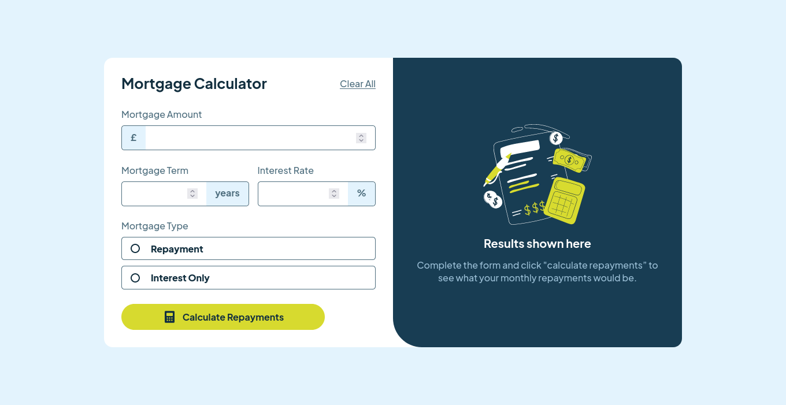
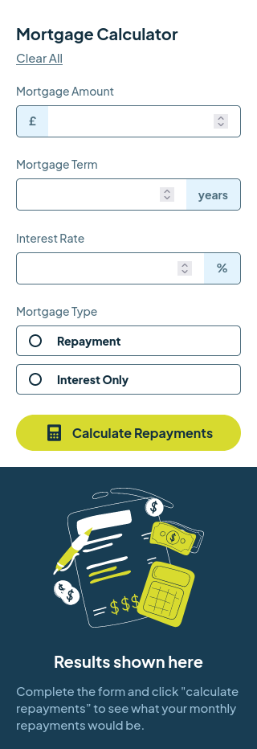

# Frontend Mentor - Solución de calculadora de amortización de hipoteca

Esta es una solución al [desafío de calculadora de amortización de hipoteca en Frontend Mentor](https://www.frontendmentor.io/challenges/mortgage-repayment-calculator-Galx1LXK73). Los desafíos de Frontend Mentor te ayudan a mejorar tus habilidades de codificación mediante la creación de proyectos realistas.

## Índice

- [Descripción general](#descripción general)
- [El desafío](#el-desafío)
- [Captura de pantalla](#captura-de-pantalla)
- [Enlaces](#enlaces)
- [Mi proceso](#mi-proceso)
- [Creado con](#creada-con)
- [Lo que aprendí](#lo-que-aprendí)
- [Desarrollo continuo](#desarrollo-continuo)
- [Recursos útiles](#recursos-útiles)
- [Autor](#autor)
- [Agradecimientos](#agradecimientos)

## Descripción general

### El desafío

Los usuarios deberían poder:

- Ingresar información de la hipoteca y ver los montos de pago mensual y total después de enviar el formulario
- Ver los mensajes de validación del formulario si algún campo está incompleto
- Completar solo el formulario usando su teclado
- Ver el diseño óptimo para la interfaz según el tamaño de la pantalla de su dispositivo
- Ver los estados de desplazamiento y enfoque de todos los elementos interactivos en la página

### Captura de pantalla

#### Diseño Escritorio


#### Diseño Tablet


#### Diseño Movil


### Enlaces

- URL de la solución: [GitHub]()
- URL del sitio en vivo: [Vervel]()

## Mi proceso

### Creado con

- Marcado HTML5 semántico
- Propiedades personalizadas de CSS
- Flexbox
- Flujo de trabajo para dispositivos móviles
- Gulp
- SASS

### Lo que aprendí

```html
<span>&#163</span><!-- Codigo HTML -->
```
```css
.proud-of-this-css {
color: papayawhip;
}
```
```js
const proudOfThisFunc = () => {
console.log('🎉')
}
```

### Recursos útiles

- [Codigos HTML](https://ascii.cl/es/codigos-html.htm):  Esto me ayudo a conocer los codigos HTMl para los caracteres como "monedero" y "porcentaje".
  
## Autor

- Mentor de frontend: [@jean266](https://www.frontendmentor.io/profile/jean266)
- Twitter: [@yourusername](https://www.twitter.com/yourusername)